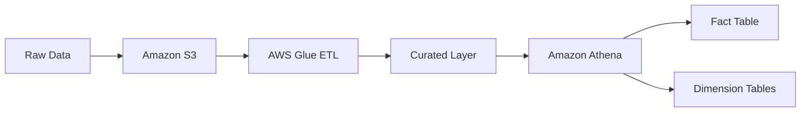

# Olist Data Engineering Project

##  Overview

This project demonstrates an end-to-end data pipeline built on AWS to transform raw e-commerce data into an analytics-ready dataset using a star schema approach.

The pipeline processes transactional data and prepares it for business analysis using scalable cloud services.

##  Data Source

The dataset used in this project is the Olist Brazilian E-commerce dataset, which contains information about customers, orders, products, and transactions.

##  Architecture

Raw data → Amazon S3 → AWS Glue (ETL) → Curated Layer → Amazon Athena → Analytics Layer (Star Schema)

## Architecture Diagram

    A[Raw Data] --> B[Amazon S3]
    B --> C[AWS Glue ETL]
    C --> D[Curated Layer]
    D --> E[Amazon Athena]
    E --> F[Fact Table]
    E --> G[Dimension Tables]

## Data Layers

* **Raw Layer**
  Stores original, unprocessed data in Amazon S3.

* **Curated Layer**
  Cleaned and transformed data prepared using AWS Glue ETL jobs.

* **Analytics Layer**
  Optimized star schema (fact and dimension tables) used for analytical queries in Amazon Athena.

##  Data Processing

Data ingestion and transformation were performed using AWS Glue jobs.

Key steps:

* Data cleaning
* Type casting
* Preparing structured datasets for analytics

---

##  Data Model

### Fact Table

* **fact_order_items_v2**
  Grain: 1 row = 1 item in an order
  Contains transactional data such as price, freight value, and order details.

### Dimension Tables

* **dim_customers**
  Contains customer-related attributes (city, state, unique id).

* **dim_products**
  Contains product-level information including product category.

---

##  Data Modeling Approach

A star schema was implemented to separate transactional data (fact) from descriptive attributes (dimensions).

Benefits:

* Improved query performance
* Simplified analytical queries
* Clear separation of concerns

---

##  Technologies Used

* Amazon S3
* AWS Glue
* Amazon Athena
* SQL

---

# Olist Data Engineering Project

## 📌 Overview

This project demonstrates an end-to-end data pipeline built on AWS to transform raw e-commerce data into an analytics-ready dataset using a star schema approach.

The pipeline processes transactional data and prepares it for business analysis using scalable cloud services.

---

## 📥 Data Source

The dataset used in this project is the Olist Brazilian E-commerce dataset, which contains information about customers, orders, products, and transactions.

---

## 🏗 Architecture

Raw data → Amazon S3 → AWS Glue (ETL) → Curated Layer → Amazon Athena → Analytics Layer (Star Schema)

---

## 🏗 Architecture Diagram

---

## 🧱 Data Layers

* **Raw Layer**
  Stores original, unprocessed data in Amazon S3.

* **Curated Layer**
  Cleaned and transformed data prepared using AWS Glue ETL jobs.

* **Analytics Layer**
  Optimized star schema (fact and dimension tables) used for analytical queries in Amazon Athena.

---

## ⚙️ Data Processing

Data ingestion and transformation were performed using AWS Glue jobs.

Key steps:

* Data cleaning
* Type casting
* Preparing structured datasets for analytics

---

## 📊 Data Model

### Fact Table

* **fact_order_items_v2**
  Grain: 1 row = 1 item in an order
  Contains transactional data such as price, freight value, and order details.

### Dimension Tables

* **dim_customers**
  Contains customer-related attributes (city, state, unique id).

* **dim_products**
  Contains product-level information including product category.

---

## 🧠 Data Modeling Approach

A star schema was implemented to separate transactional data (fact) from descriptive attributes (dimensions).

Benefits:

* Improved query performance
* Simplified analytical queries
* Clear separation of concerns

---

## ⚙️ Technologies Used

* Amazon S3
* AWS Glue
* Amazon Athena
* SQL

---

## 📈 Example Analytics

* Top cities by revenue
* Average order value (AOV)
* Total orders by city
* Customer distribution by city
* Top product categories by revenue

---

# Olist Data Engineering Project

## 📌 Overview

This project demonstrates an end-to-end data pipeline built on AWS to transform raw e-commerce data into an analytics-ready dataset using a star schema approach.

The pipeline processes transactional data and prepares it for business analysis using scalable cloud services.

---

## 📥 Data Source

The dataset used in this project is the Olist Brazilian E-commerce dataset, which contains information about customers, orders, products, and transactions.

---

## 🏗 Architecture

Raw data → Amazon S3 → AWS Glue (ETL) → Curated Layer → Amazon Athena → Analytics Layer (Star Schema)

---

## 🏗 Architecture Diagram

---

## 🧱 Data Layers

* **Raw Layer**
  Stores original, unprocessed data in Amazon S3.

* **Curated Layer**
  Cleaned and transformed data prepared using AWS Glue ETL jobs.

* **Analytics Layer**
  Optimized star schema (fact and dimension tables) used for analytical queries in Amazon Athena.

---

## ⚙️ Data Processing

Data ingestion and transformation were performed using AWS Glue jobs.

Key steps:

* Data cleaning
* Type casting
* Preparing structured datasets for analytics

---

## 📊 Data Model

### Fact Table

* **fact_order_items_v2**
  Grain: 1 row = 1 item in an order
  Contains transactional data such as price, freight value, and order details.

### Dimension Tables

* **dim_customers**
  Contains customer-related attributes (city, state, unique id).

* **dim_products**
  Contains product-level information including product category.

---

## 🧠 Data Modeling Approach

A star schema was implemented to separate transactional data (fact) from descriptive attributes (dimensions).

Benefits:

* Improved query performance
* Simplified analytical queries
* Clear separation of concerns

---

## ⚙️ Technologies Used

* Amazon S3
* AWS Glue
* Amazon Athena
* SQL

---

## 📈 Example Analytics

* Top cities by revenue
* Average order value (AOV)
* Total orders by city
* Customer distribution by city
* Top product categories by revenue

---

## 📂 SQL Queries

* [Top cities by revenue](sql/top_cities_by_revenue.sql)
* [Average order value (AOV)](sql/average_order_value.sql)
* [Total orders by city](sql/total_orders_by_city.sql)
* [Customer distribution by city](sql/customer_distribution_by_city.sql)
* [Top product categories by revenue](sql/top_product_categories_by_revenue.sql)

---

##  Key Learnings

* Built a layered data architecture (raw → curated → analytics)
* Implemented a star schema using CTAS in Athena
* Applied data modeling concepts such as grain definition
* Used JOIN strategies (INNER vs LEFT)
* Created business-oriented analytical queries
