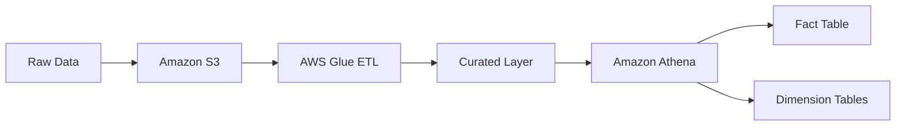
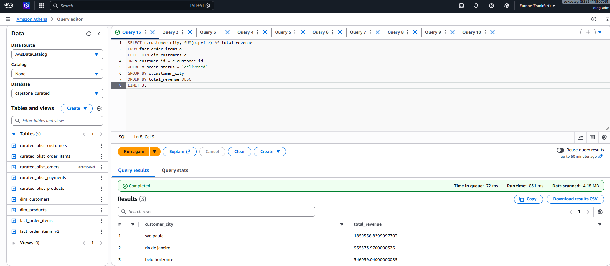

# Olist Data Engineering Project

## 📌 Overview

This project demonstrates an end-to-end data pipeline built on AWS to transform raw e-commerce data into an analytics-ready dataset using a star schema approach.

The pipeline processes transactional data from the Olist dataset and prepares it for business analysis using scalable cloud services.

---

## 📥 Data Source

The dataset used in this project is the Olist Brazilian E-commerce dataset, which includes information about:

* Orders
* Customers
* Products
* Order items
* Payments

---

## 🏗 Architecture

Raw data → Amazon S3 → AWS Glue (ETL) → Curated Layer → Amazon Athena → Analytics Layer (Star Schema)

---

## 🏗 Architecture Diagram

---

## 🧱 Data Layers

* **Raw Layer**
  Stores original, unprocessed data in Amazon S3.

* **Curated Layer**
  Cleaned and transformed datasets produced by AWS Glue jobs. Data is stored in optimized Parquet format.

* **Analytics Layer**
  Star schema consisting of fact and dimension tables, optimized for analytical queries in Athena.

---

## ⚙️ Data Processing

Data ingestion and transformation were performed using AWS Glue ETL jobs.

Main transformations:

* Data cleaning (handling nulls and invalid values)
* Type casting (timestamps, numeric fields)
* Deriving new fields (year, month)
* Structuring data for analytics

---

## 🔄 AWS Glue ETL Jobs

The curated layer was created using AWS Glue ETL jobs. Each job processes a specific dataset and writes optimized Parquet data back to Amazon S3.

### Implemented Jobs

* **Orders ETL**

  * Cleaned and transformed orders data
  * Converted timestamp fields
  * Added `order_year` and `order_month`
  * Stored output in Parquet format
  * Applied partitioning by year and month

* **Customers ETL**

  * Processed customer data
  * Selected relevant attributes for analytics

* **Order Items ETL**

  * Processed item-level order data
  * Preserved item-level grain

* **Products ETL**

  * Processed product metadata
  * Prepared product categories

* **Payments ETL**

  * Processed payment data
  * Prepared payment types and values

---

## 🧩 Partitioning Strategy

The orders dataset in the curated layer is partitioned by:

* `order_year`
* `order_month`

Benefits:

* Reduced data scanned in Athena
* Improved query performance
* Efficient filtering for time-based analysis

---

## 📊 Data Model

### Fact Table

* **fact_order_items_v2**
  Grain: 1 row = 1 item in an order
  Contains transactional data such as:

  * price
  * freight_value
  * order details

### Dimension Tables

* **dim_customers**
  Customer attributes:

  * city
  * state
  * unique identifier

* **dim_products**
  Product attributes:

  * product category

---

## 🧠 Data Modeling Approach

A star schema was implemented to:

* Separate transactional data (fact) from descriptive data (dimensions)
* Improve query performance
* Simplify analytical queries

Key principle:

* The grain of the fact table is clearly defined before writing analytical queries

---

## ⚙️ Technologies Used

* Amazon S3
* AWS Glue
* Amazon Athena
* SQL

---

## 📂 SQL Queries Examples

* [Top cities by revenue](sql/top_cities_by_revenue.sql)
* [Average order value (AOV)](sql/average_order_value.sql)
* [Total orders by city](sql/total_orders_by_city.sql)
* [Customer distribution by city](sql/customer_distribution_by_city.sql)
* [Top product categories by revenue](sql/top_product_categories_by_revenue.sql)

---

## 📸 Example Query Result

Below is an example of a query executed in Amazon Athena:

---

## 🚀 Key Learnings

* Built a layered data architecture (raw → curated → analytics)
* Designed and implemented a star schema
* Defined and applied data grain correctly
* Implemented ETL pipelines using AWS Glue
* Used partitioning to optimize query performance
* Applied SQL for business-oriented analytics
* Understood differences between INNER JOIN and LEFT JOIN in practice
